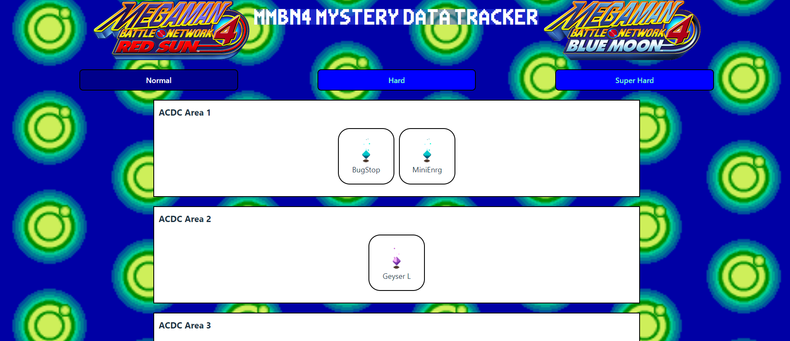

# MMBN4 Mystery Data Tracker

## Table of Contents
* [Description](#description)
* [Installation](#installation)
* [Usage](#usage)
* [Contribution](#contribution)
* [Technologies Utilized](#Technologies-Utilized)
* [Screenshot](#screenshot)
* [Link](#link)

## Description
This is an application intended to allow the user to keep track of items they have collented in Megaman Battle Network 4

## Installation
1. Fork the repository and clone it locally. Install the necessary dependancies using ```npm i``` and ```npm i --dev``` in the server directory and  ```npm i``` in the client directory. 
2. Create a postgresql database to store our user data. Create a local environment file ```.env.local``` in the server directory.  Write the relevant data: ``` DB_USER, DB_NAME, and DB_PASSWORD```pertaining to our postgresql database in the ```env.local``` file you created.
You will also need  a ```JWT_SECRET_KEY``` to implement authentication. You can use the ```CreateSecretKey``` function in the password-hasher to do this
Be sure to have postgresql 14 or higher installed on your local machine.

3. Create a local environment file ```.env.local``` in the client directory as well and store the link to the server as: ```VITE_BASE_URL```. 

4. Relevant CLI:    
    - Express Server Side
        1. ```npm run migrate-latest``` to run migrations on the database 
        2. ```npm start``` to start the Express server
        3. To run a dev server use ```npm run express-dev``` instead 
    - Vite Client Side
        1. ```npm run dev``` 

## Usage 
 A user can register by entering a username and a password. They can then log in and swap beween the three available difficulties freely. The user can click on the items to check them off as they find the items in game. The user can also click the "Reset All" butt

## Contribution
 Submit a pull request and bring up an issue if I think your addition would work well as a new feature, I'll make a pull request

## Technologies-Utilized
- Postgresql (Knex)
- Express
- React
- Node
- Axios
- JsonWebToken

## Screenshot



## Link

https://mmbn4-item-tracker-1.onrender.com/


